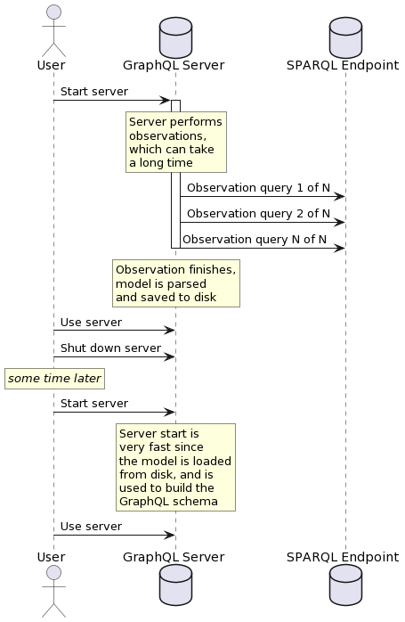

# Model Checkpointing

The observation phase can take quite a long time, and it
is undesirable to have to wait for the entire observation
phase to happen again every time you want to start the GraphQL
endpoint.

Therefore SPARQLess allows you to use the following
options to save the generated data model to disk,
and then later reuse it instead of carrying out observations
again.



```ts
interface ModelCheckpointConfig {
    loadModelFromCheckpoint: boolean;
    saveModelToFile: boolean;
    overwriteFile: boolean;
    checkpointFilePath: string;
}
```

`checkpointFilePath` points to the file which will be used
to store/load model checkpoints.

If `saveModelToFile` is set to `true`, the model will be saved
to the configured file after it is built from the observations.
If the file already exists and `overwriteFile` is set to `false`,
the file will not be overwritten by the new checkpoint.

If `loadModelFromCheckpoint` is set to `true`, at startup,
SPARQLess will check whether the checkpoint exists.
If it does, then it will use the model checkpoint rather than
carrying out observations again.
