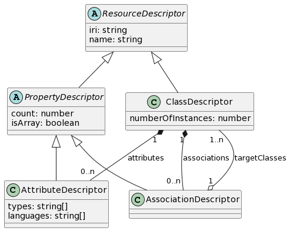

# Parsing

Observations made about a SPARQL endpoint are then parsed by
the `ObservationParser` class. It contains an implementation of an algorithm
which converts RDF observations into **descriptors**. **Descriptors** are
plain JavaScript objects which describe the model of the data in the SPARQL
endpoint. They are the stepping stone between the RDF observations,
and creation of the GraphQL schema.

This parsing algorithm is not the only possible parsing algorithm for the
observations we are collecting. Observations are simply pieces of information
to be interpreted, and there are many ways of interpreting that information.
The parsing algorithm implemented is simply one which uses all of the observations
SPARQLess is currently collecting efficiently. There are currently
no plans to let library users specify custom parsing algorithms, but should
the need arise, the library design is modular enough to allow it.

## Descriptors

This section contains a more thorough explanation of what each descriptor
means, and what it says about the underlying data. The following is a class
diagram showing all of the currently used descriptors:



### ResourceDescriptor

Describes any RDF resource which is identified by
an IRI, i.e. classes and properties. This descriptor also has a name field,
which is meant to contain a GraphQL-compatible, human-readable name,
meaning a string only consisting of characters `[_a-zA-Z0-9]`.
This name is used as the GraphQL identifier for this resource.
After all, it's much easier for humans to read and reason about
`Label` than `http://www.w3.org/2008/05/skos-xl#Label`.

```ts
interface ResourceDescriptor {
    iri: string;
    name: string;
}
```

This descriptor is extended by all other descriptors.

### ClassDescriptor

Describes a single class present in the dataset.

```ts
interface ClassDescriptor extends ResourceDescriptor {
    numberOfInstances: number;
    attributes: AttributeDescriptor[];
    associations: AssociationDescriptor[];
}
```

For example, if the dataset contains 5 dogs and 10 cats,
we would have the following class descriptors:

```ts
[
    {
        iri: 'http://example.com/Dog',
        name: 'Dog',
        numberOfInstances: 5,
        attributes: [],
        associations: [],
    },
    {
        iri: 'http://example.com/Cat',
        name: 'Cat',
        numberOfInstances: 10,
        attributes: [],
        associations: [],
    }
]
```

### PropertyDescriptor

Describes a property of a class. A property is any relation
in the dataset where the subject is a class. This descriptor is
not instantiated on its own, rather it is always as an instance
of an `AssociationDescriptor` or an `AttributeDescriptor`.

```ts
interface PropertyDescriptor extends ResourceDescriptor {
    count: number;
    isArray: boolean;
}
```

### AssociationDescriptor

A special case of a property where its domain is another class.
If an association has multiple target classes, its range is their
union.

```ts
interface AssociationDescriptor extends PropertyDescriptor {
    targetClasses: ClassDescriptor[];
}
```

In our cats and dogs example, let's say each cat has a friend among the dogs.
That would be modelled like so:

```ts
{
    iri: 'http://example.com/Cat',
    name: 'Cat',
    numberOfInstances: 10,
    attributes: [],
    associations: [{
        iri: 'http://example.com/friend',
        name: 'friend',
        count: 10,
        isArray: false,
        targetClasses: [{
            iri: 'http://example.com/Dog',
            name: 'Dog',
            numberOfInstances: 5,
            attributes: [],
            associations: [],
        }],
    }],
}
```

### AttributeDescriptor

A special case of a property where its domain is a literal,
i.e. a primitive value like a string or an integer.

```ts
interface AttributeDescriptor extends PropertyDescriptor {
    types: string[];
    languages: string[];
}
```

The `types` array contains a list of types in this attribute's range.
If the `types` array contains a language string type, then the `languages`
array will hold a list of available languages for this language string.
