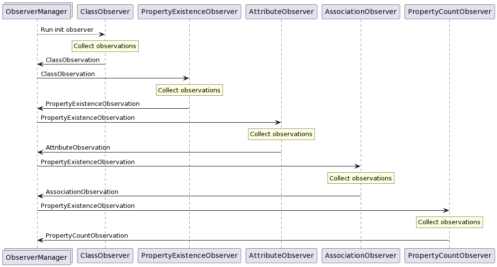

# Observation

When the application is configured, the user runs the app. Then the application
starts observing the SPARQL endpoint, and collecting observations in the form
of RDF quads (stored in the `QueryResult` type). These quads are generally
constructed to have a blank node subject representing a single observation,
and its properties then describe that observation.

## Ontology

All observations conform to an ontology described in the `ontology.ttl` file,
which contains a [RDFS](https://www.w3.org/TR/rdf-schema/) definition
of the observations in the [Turtle](https://www.w3.org/TR/turtle/) format.

## Observer system

Observation is essentially just a process where we need to execute
many SPARQL queries, where some queries have dependencies on outputs
of previous queries. As an example, we cannot observe the existence
of properties on some class, before we even know about the class'
existence.

Therefore the observation logic is split up into observer classes,
namely `EndpointObserver` and `InitEndpointObserver`. These observers
each collect a specific set of observations. `EndpointObserver`s may
declare dependencies on observations produced by other observers.
`InitEndpointObserver`s do not required any previous observations to
do their observations, and they produce the initial observations
which are in turn used by other observers.

The flow of data between observers and their invokation is handled
by the `ObserverManager` class. It collects the outputs of its
registered observers, and triggers observers which are subscribed
to new observations accordingly.

Its usage looks as follows:

```ts
const observerManager = new ObserverManager(config);

observerManager.subscribeInit(new ClassObserver());
observerManager.subscribe(new PropertyObserver());
observerManager.subscribe(new AttributeObserver());
observerManager.subscribe(new AssociationObserver());
observerManager.subscribe(new PropertyCountObserver());

const observations: Observations = await observerManager.runObservers();
```

## Implemented observers

While it is possible for library users to implement and use their own observers,
some observers are pre-implemented to facilitate the main flow of SPARQL2GraphQL.

They each collect a single kind of observation from the ontology:

- `ClassObserver`: collects `ClassObservation`s
- `PropertyObserver`: collects `PropertyExistenceObservation`s
- `AttributeObserver`: collects `AttributeObservation`s
- `AssociationObserver`: collects `AssociationObservation`s
- `PropertyCountObserver`: collects `PropertyCountObservation`s
- `InstanceObserver`: collects `InstanceObservation`s *(currently unused)*

The data flow between these observers looks like this:


