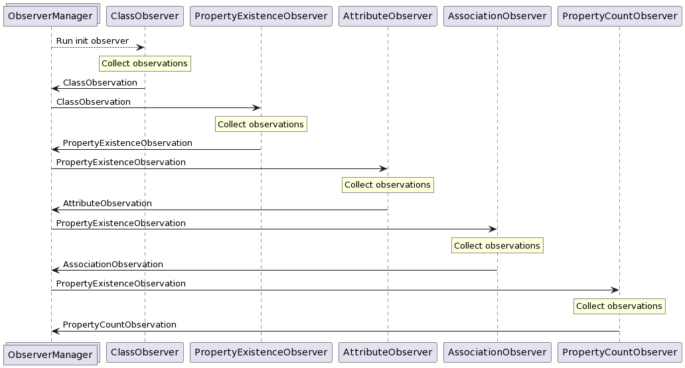

# Observation

When the application is configured, the user runs the app. Then the application
starts observing the SPARQL endpoint, and collecting observations in the form
of RDF quads (stored in the `QueryResult` type). These quads are generally
constructed to have a blank node subject representing a single observation,
and its properties then describe that observation.

## Ontology

All observations conform to an ontology described in the `ontology.ttl` file,
which contains a [RDFS](https://www.w3.org/TR/rdf-schema/) definition
of the observations in the [Turtle](https://www.w3.org/TR/turtle/) format.

## Observer system

Observation is essentially just a process where we need to execute
many SPARQL queries, where some queries have dependencies on outputs
of previous queries. As an example, we cannot observe the existence
of properties on some class, before we even know about the class'
existence.

Therefore the observation logic is split up into observer classes,
namely `EndpointObserver` and `InitEndpointObserver`. These observers
each collect a specific set of observations. `EndpointObserver`s may
declare dependencies on observations produced by other observers.
`InitEndpointObserver`s do not required any previous observations to
do their observations, and they produce the initial observations
which are in turn used by other observers.

The flow of data between observers and their invokation is handled
by the `ObserverManager` class. It collects the outputs of its
registered observers, and triggers observers which are subscribed
to new observations accordingly.

Its usage looks as follows:

```ts
const observerManager = new ObserverManager(config);

observerManager.subscribeInit(new ClassObserver());
observerManager.subscribe(new PropertyObserver());
observerManager.subscribe(new AttributeObserver());
observerManager.subscribe(new AssociationObserver());
observerManager.subscribe(new PropertyCountObserver());

const observations: Observations = await observerManager.runObservers();
```

## Implemented observers

While it is possible for library users to implement and use their own observers,
some observers are pre-implemented to facilitate the main flow of SPARQL2GraphQL.

They each collect a single kind of observation from the ontology:

- `ClassObserver`: collects `ClassObservation`s. These describe the existence
of classes and their number of instances in the dataset.
- `PropertyObserver`: collects `PropertyExistenceObservation`s. These describe
the existence of properties on given classes.
- `AttributeObserver`: collects `AttributeObservation`s. These describe attributes,
i.e. properties whose ranges contain literals (strings, ints, booleans, ...).
- `AssociationObserver`: collects `AssociationObservation`s. These describe
associations whose ranges contain other classes.
- `PropertyCountObserver`: collects `PropertyCountObservation`s. These count
the number of occurences of a given property in the dataset. This can be useful
for users to determine which classes are important in the data.
- `PartialFunctionObserver`: collects `PartialFunctionObservation`s.
These describe properties which are guaranteed not to be array-type properties,
i.e. properties which are instantiated no more than once for any given
class instance.
- `InstanceObserver`: collects `InstanceObservation`s. These describe
the existence of class instances. *(currently unused)*

The data flow between these observers looks like this:



## Observation speed

Essential observations for constructing the GraphQL schema are `ClassObservation`,
`PropertyExistenceObservation`, `AttributeObservation` and `AssociationObservation`.
Other observations are unnecessary, and they just enhance the schema further.
If the fastest startup time is desired, you may want to consider disabling
non-required observations, and configuring [hot reloading](hot_reloading.md)
to perform these additional observations in the background while
the GraphQL endpoint is already functional.

An interesting bit of information about observation query performance is the fact
that in SPARQL endpoints with multiple graphs, adding a `GRAPH ?g { ... }` clause
around the query body led to significant performance improvements on certain queries.
Namely queries with many class instances across multiple graphs which originally took
tens of minutes now take a few minutes at maximum. While this change did slightly
increase execution times for other queries, the total observation time for
endpoints with mulitple graphs has improved dramatically.
