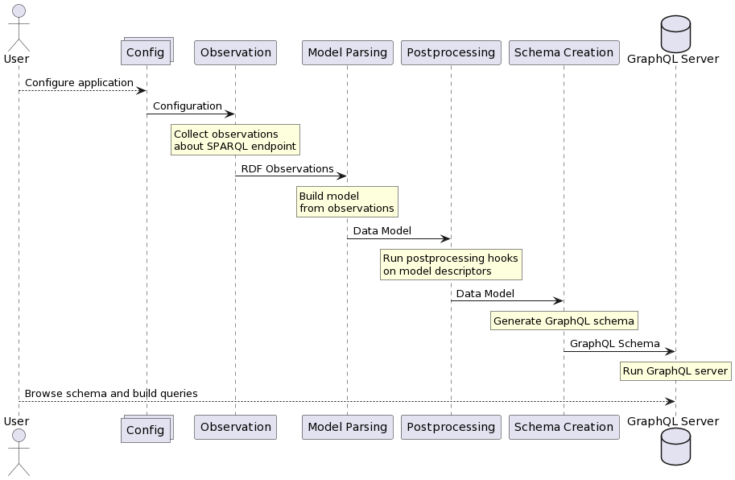
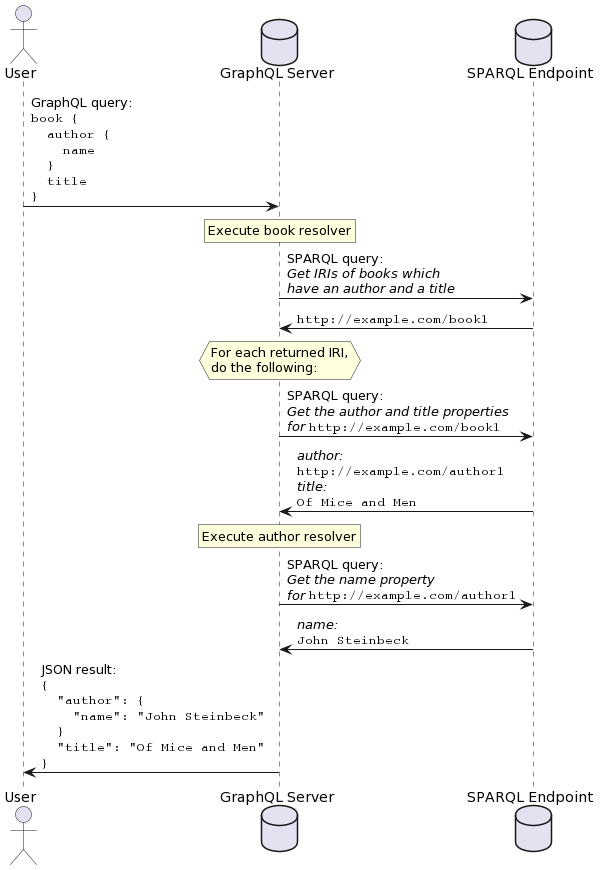

# Overview of how it all works

This page will explain the process used by SPARQLess when creating
a GraphQL endpoint from the SPARQL endpoint.

## Bootstrapping flow

First of all, the user should configure the application. The most basic configuration step
is to configure the SPARQL endpoint to observe. You can read more about
configuration [here](configuration.md).

The bootstrapping phase of SPARQLess is divided into four distinct phases:

1. [**Observation**](observation.md)
2. [**Model Parsing**](model_parsing.md)
3. [**Postprocessing**](postprocessing.md)
4. [**Schema Creation**](schema.md)

The [observation](observation.md) phase uses SPARQL queries
to extract some information about the schema of the data
in the endpoint. There are many kinds of observations,
but the most basic ones are along the lines of
`X is a class with N instances` or `Y is a property of class X`.
These observations are in the form of RDF data conforming
to an ontology defined by SPARQLess. This phase
can take up to tens of minutes to execute if the SPARQL
endpoint contains a large amount of data.

After the observations are collected, the
[model parsing](model_parsing.md) phase converts these
observations into a set of JavaScript objects describing the data
schema. These objects are referred to as **descriptors**,
since they *describe* the data model.

The [postprocessing](postprocessing.md) phase is meant
to execute functions called **postprocessing hooks**
on descriptors (parts of the model), after the whole
model has been built. An example of a postprocessing
is giving each property and class in the model
a short human-readable name, which it does not necessarily
have in the original RDF representation.

The [schema creation](schema.md) phase takes the model and
its descriptors, and converts it into a GraphQL schema.

After all of these phases are performed, a GraphQL endpoint
is started using the generated schema (using
[Apollo Server](https://www.apollographql.com/docs/apollo-server/)).
The whole flow we just described looks like this:



As the diagram shows, at the end of the setup, there is a fully functional
GraphQL endpoint active, which the user is free to explore and query.
Visiting the endpoint URL in the browser will redirect the user
to a playground, which provides helpful tools for exploring
and querying.

## Querying flow

SPARQLess utilizes a query translation approach, whereby incoming
GraphQL queries are translated into SPARQL queries, executed on the
SPARQL endpoint, and their results are aggregated into a JSON
response returned by the GraphQL endpoint.

GraphQL querying is based on the concept of
[resolvers](https://graphql.org/learn/execution/), which are functions,
each of which is able to return a single requested property.
If the following GraphQL query is sent to the GraphQL endpoint:

```graphql
book {
    author {
        name
    }
    title
}
```

then a resolver will be called for the `books` field, and when that
resolver returns an object, resolvers for the `author` and `title`
fields will be run. SPARQLess resolvers effectively translate
each field query into a SPARQL query if the queried field contains
a non-scalar value. Scalar values are fetched with the parent object's
query.

Execution of this example query would look like this:



## Components

The following is a list of components you can see in the diagrams above,
with more detailed descriptions of what they do and how they do it:

- [Observation](observation.md)
- [Model Parsing](model_parsing.md)
- [Postprocessing](postprocessing.md)
- [Schema Creation](schema.md)
- [Querying](querying.md)
- [Model Checkpointing](model_checkpointing.md)
- [Hot Reloading](hot_reloading.md)
