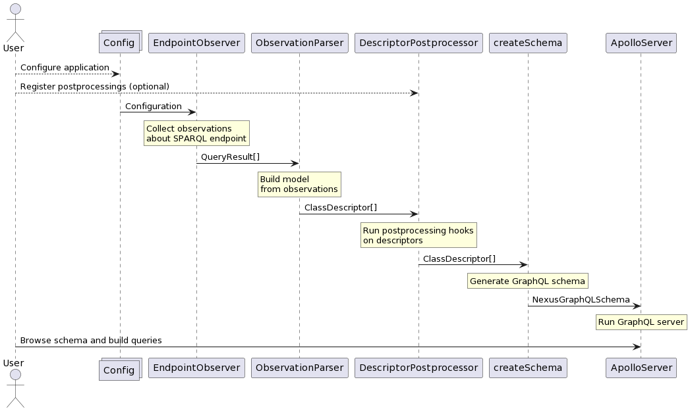

# Overview of how it all works

This page will explain the process used by SPARQL2GraphQL when creating
a GraphQL endpoint from the SPARQL endpoint.

## General flow

First of all, the user should configure the application. The most basic configuration step
is to configure the SPARQL endpoint to observe. However, besides other configuration
values, the user may also write custom postprocessing hooks for parts of the
extracted data model. You can read more about those [here](postprocessing.md).

When the user configures and runs the application, the setup flow looks
like this:

As the diagram shows, at the end of the setup, there is a fully functional
GraphQL endpoint active, in which the user can explore and query the endpoint.

**TODO:** ADD QUERY RESOLVERS INFORMATION HERE WHEN THAT FEATURE IS FINISHED
(INCLUDING A GRAPH SHOWING HOW THE GraphQL QUERY IS EXECUTED)

## Components

The following is a list of components you can see in the diagrams above,
with more detailed descriptions of what they do and how they do it:

- [Observation](observation.md)
- [Parsing](parsing.md)
- [Postprocessing](postprocessing.md)
- [Schema Creation](schema.md)
- [Querying](querying.md)
- [Hot Reloading](hot_reloading.md)
