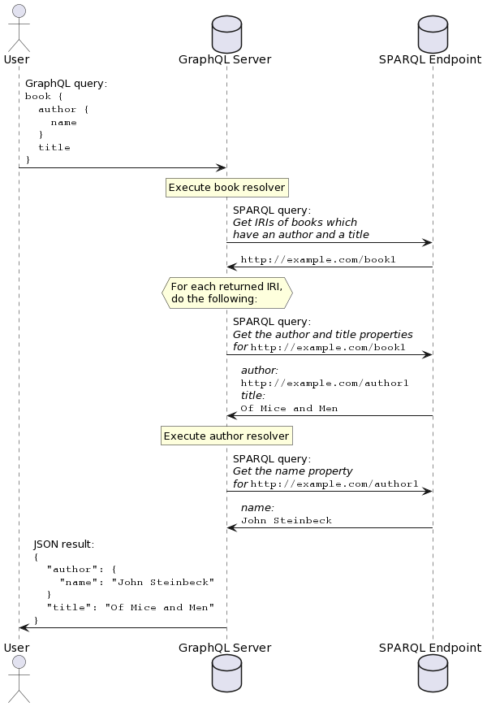

# Querying

> **_NOTE:_**  This introduction is identical to the introduction
given in the [overview](overview.md). If you have already read it,
you may skip to the other subsections of this article.

SPARQLess utilizes a query translation approach, whereby incoming
GraphQL queries are translated into SPARQL queries, executed on the
SPARQL endpoint, and their results are aggregated into a JSON
response returned by the GraphQL endpoint.

GraphQL querying is based on the concept of
[resolvers](https://graphql.org/learn/execution/), which are functions,
each of which is able to return a single requested property.
If the following GraphQL query is sent to the GraphQL endpoint:

```graphql
book {
    author {
        name
    }
    title
}
```

then a resolver will be called for the `books` field, and when that
resolver returns an object, resolvers for the `author` and `title`
fields will be run. SPARQLess resolvers effectively translate
each field query into a SPARQL query if the queried field contains
a non-scalar value. Scalar values are fetched with the parent object's
query.

Execution of this example query would look like this:



## Query root execution

> **_NOTE:_** The following description of query execution functionality
describes the way it is implemented in this library. This is not the only
possible way of implementing querying, and the design of this library
accounts for different possible implementations in the future.

Each GraphQL query has a root `Query` object, whose fields
are all object types extracted from the SPARQL endpoint.
Each of these fields is a non-null list of objects,
which are resolved with a **class resolver** (implemented by
the `createClassResolver` factory function).

The **class resolver** is a function which is called by Apollo Server
any time class instances are requested as part of a GraphQL query.
Its job is to return the requested instances as plain JavaScript
objects. It does this by looking at the requested fields for these
objects, and executing a SPARQL query which returns a list of IRIs
representing the objects to be returned from the resolver.

If we take the following GraphQL query:

```graphql
dcat_Dataset(limit: $limit) {
    title {
      cs
      en
    }
    conformsTo
}
```

then the corresponding SPARQL IRI query will look like this:

```sparql
SELECT DISTINCT ?instance
WHERE
{
    ?instance a <http://www.w3.org/ns/dcat#Dataset> .

    ?instance <http://purl.org/dc/terms/title> [] .
    ?instance <http://purl.org/dc/terms/conformsTo> [] .        
}
LIMIT 10
```

Afterwards, the **class resolver** takes the received instance IRIs,
and for each of them, it executes a SPARQL query asking for that instance's
properties which have been requested by the GraphQL query.

Assuming one of the IRIs returned by the previous query was
`https://data.gov.cz/zdroj/datové-sady/00297569/3384952`, then the followup
query asking for this instance's properties will look like this:

```sparql
SELECT ?property ?value
WHERE
{
    VALUES (?property)
    {
        ( <http://purl.org/dc/terms/title> )
        ( <http://purl.org/dc/terms/conformsTo> )
    }
    <https://data.gov.cz/zdroj/datové-sady/00297569/3384952> ?property ?value .
}
```

Finally, the **class resolver** will create a plain JavaScript object
containing the returned properties, and it will return it to Apollo Server.
Apollo Server will then *execute a resolver for each field on this object*.

These additional resolvers are responsible for taking the data retrieved
by the class resolver, and converting it into the appropriate format
for return as the GraphQL query response. What this means in practice
is that while everything is stored as a string in RDF,
these additional resolvers have to convert these strings to the appropriate
data types for their respective fields. For example, a boolean field
resolver would parse the retrieved string into a boolean.

This chaining of resolvers will occur recursively for each field
of objects nested in the query, until all fields have been resolved.
The final GraphQL response for our example scenario will look like this:

```json
"data": {
    "dcat_Dataset": [
        {
            "title": {
                "cs": [
                    "Moravskoslezský kraj - úřední deska"
                ],
                "en": [
                    "Official bulletin board of Moravian-Silesian Region "
                ]
            },
            "conformsTo": [
                "https://ofn.gov.cz/úřední-desky/",
                "https://ofn.gov.cz/úřední-desky/2021-07-20/"
            ]
        },
      ...
    ]
}
```

The concept of resolvers is described in more detail in the
[official GraphQL documentation](https://graphql.org/learn/execution/)
in case you wish to learn more.
