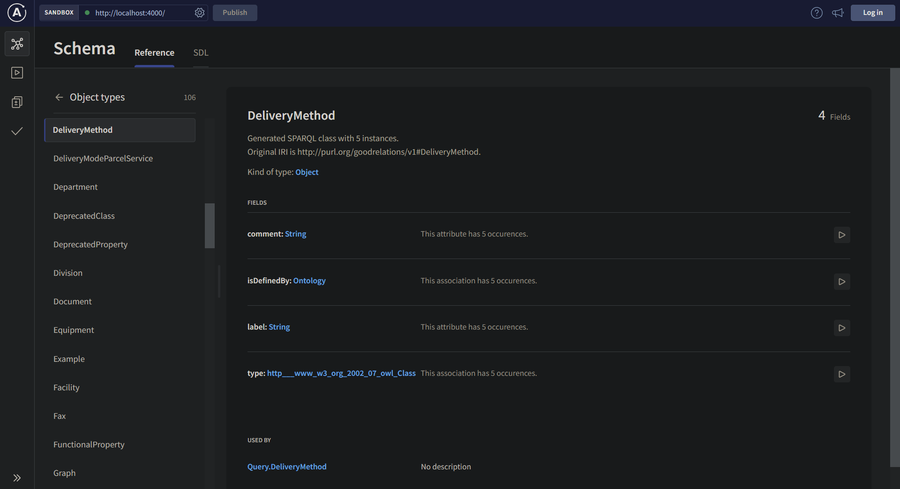
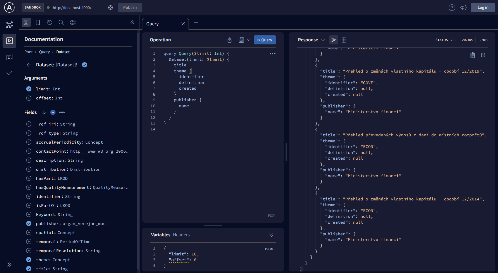

# Usage guide

This page will explain how to set up SPARQL2GraphQL for a given SPARQL endpoint, step-by-step.

## Installing dependencies

The project is written in TypeScript and uses Node.js as its runtime.

You will need to have the following installed before you proceed with usage:

- Node 16.13.0 (Gallium LTS) - easily managed with [nvm](https://github.com/nvm-sh/nvm)
- npm

Once you have installed them, run `npm install` in the project root directory to install
all required dependencies with npm.

## Library interface

The main functionality is encapsulated by the `SPARQL2GraphQL` class in `src/api/index.ts`.
This class contains functions for the main tasks users may want to perform.

Most notably, the `buildSchemaAndRunEndpoint` functions is provided for users
who want the least configuration necessary. It is enough to simply set up a `Config`
as shown in the next section, and run SPARQL2GraphQL like so:

```ts
const config = {
    ...
};

const sparql2graphql = new SPARQL2GraphQL();

// This method returns a Promise, so you should await it
// if you want to do something after the server has started.
sparql2graphql.buildSchemaAndRunEndpoint(config);
```

The `SPARQL2GraphQL` class also contains other functions which perform
smaller parts of the whole algorithm, which you may want to use if your
task is more complex than *convert this SPARQL endpoint into a GraphQL endpoint*.
For example, the `observeAndBuildSchema` function performs all the steps up to
and including schema building, meaning one could use it to simply save the
GraphQL schema into a file and do something else with it, rather than
starting a GraphQL endpoint.

## Edit configuration

There is one required configuration step before you run the library - configuring
the SPARQL endpoint you want to run. This is done by creating a `Config` object,
which you will pass to SPARQL2GraphQL functions. There is a pre-defined list of known
online and working endpoints in `src/observation/endpoints.ts` in case you just want
to try the project without having a specific SPARQL endpoint in mind, but you can
easily define your own.

A very basic configuration can look like this:

```ts
import { Config, SIMPLE_LOGGER } from './api/config';

const config: Config = {
    endpoint: {
        url: 'https://data.gov.cz/sparql',
        name: 'CZ Government Open Data',
    },
    logger: SIMPLE_LOGGER,
};
```

The endpoint `name` can be whatever you want, it's just an easily readable
identifier used in logs. The `logger` property is not mandatory,
but it is very helpful to specify a logger in order to see what's
going on. Any [winston](https://github.com/winstonjs/winston) logger will do,
but the `SIMPLE_LOGGER` defined in `src/api/config.ts` defines a sane default
logger which logs the most important messages to the console.

There are other configuration values in `Config` which you are free to modify, but they have
sensible defaults in case you just want to get started. If you want to find out
more about additional configuration options, you can refer to the
[configuration guide](configuration.md). Alternatively, you can examine
their definition in the code, where they are also documented.

## Run it

Putting together the above code examples is enough to start a SPARQL2GraphQL instance,
which will observe the configured SPARQL endpoint and convert it to a GraphQL one.
Alternatively, if you are running SPARQL2GraphQL from this repository,
you can run `npm start`, which will run `src/main.ts`, which is an entrypoint
meant for starting the server from withing this repository.
In that case, edit your configuration there.

In the logs, you will see that it will first run some observations on the target
endpoint to collect information about its schema and the data contained within.
This may take a while, especially for large datasets, depending on the configuration
parameters used. As an example, the [CZ Government open data](https://data.gov.cz/english/) endpoint
shown in the configuraiton above takes under 10 minutes to have a fully functional
GraphQL instance running.

After observation is finished, you will see that a fully functional GraphQL interface is
available for you to explore and query at the configured port
([localhost:4000](http://localhost:4000) by default).

## Explore the schema

When you open the GraphQL interface in your browser, you will see an interface
provided by Apollo Server. It allows you to explore the schema including all of the available
classes, as well as their properties, relations, how many times they occur in the dataset
and other metadata.



The interface also allows you to interactively build and execute queries against the endpoint.

## Hot reloading

You may notice that with the default configuration, another round of observation
will start right after the GraphQL server is created.

This is [hot reloading](hot_reloading.md) in action. Because fully observing the entire
dataset in the endpoint may take a long time, the initial observations are limited
by the default configuration - observation will only count up to 1000 occurences
for each property in the dataset.

After the server has started, it's fully available and functional for purposes of
schema exploration and querying. In the background, SPARQL2GraphQL continues
to make more detailed observations, and seamlessly updating the GraphQL
schema in the GraphQL endpoint.

You can read more about hot reloading [here](hot_reloading.md).

## Query the endpoint

If you are not yet familiar with how to compose GraphQL queries, you can learn more
about GraphQL [here](https://graphql.org/learn/).

You can use the interface to query the data, either writing the query yourself,
or using the graphical query editor to compose the query.



**NOTE:** be careful running queries which have an unlimited result size!
If your SPARQL endpoint contains a large dataset, the query could either
run for a *very* long time, or it might just fail due to a timeout.
You should use the `limit` and `offset` parameters provided in each query
field as shown in the image above.
